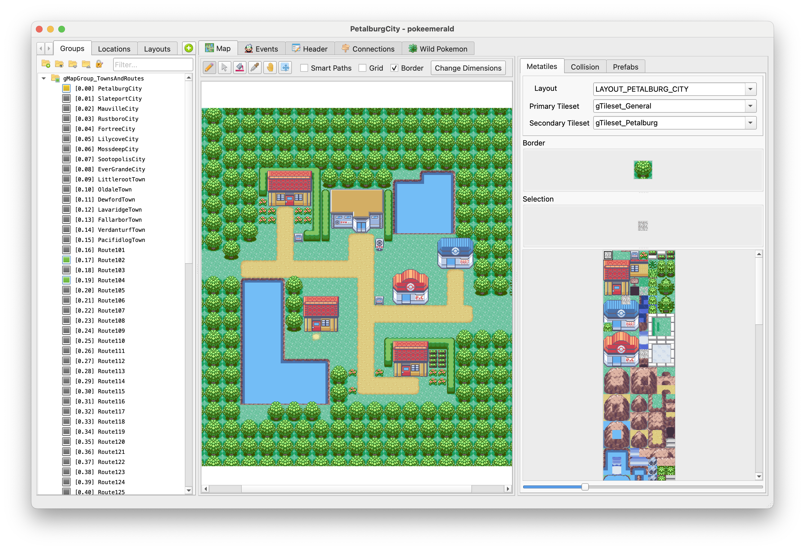

# Porymap Studio

[](https://github.com/zenzero82/Porymap-Zen-Fork/actions/workflows/build.yml)

Porymap Studio is an enhanced native C++/Qt map editor for Pokémon Generation 3
decompilation projects. It is focused on faster map creation, automated
workflows, and long-term support for [pokeemerald-expansion][pokeemerald-expansion]
while retaining compatibility with [pokeemerald][pokeemerald],
[pokefirered][pokefirered], and [pokeruby][pokeruby] wherever practical.

## Project status

The Studio development foundation is in place. Existing Porymap editing
behavior is preserved; image-to-map reconstruction, Porytiles integration,
automatic tileset generation, collision assistance, and ROM build automation
remain future milestones.

See:

- [Architecture guide](docs/PORYMAP_STUDIO_ARCHITECTURE.md)
- [Development roadmap](docs/PORYMAP_STUDIO_ROADMAP.md)
- [Metatile and Porytiles technical notes](docs/PORYMAP_STUDIO_TECHNICAL_NOTES.md)
- [Build instructions](INSTALL.md)

## Upstream Porymap

Porymap Studio is a fork of [Porymap][porymap], created by huderlem and its
contributors. Porymap provides the editor architecture, project compatibility,
rendering, and file-format support on which Studio is built.

Core internal names and the `porymap` executable name are intentionally retained
to reduce merge conflicts with upstream. License and attribution files from
Porymap remain authoritative and must be preserved.

The [upstream Porymap manual][porymap-manual] remains the reference for existing
editor features.

## Development

Porymap Studio uses C++17, Qt, qmake, and GNU Make. On Replit:

```bash
./scripts/replit-build.sh
./scripts/replit-run.sh
```

The first command performs a native build. The second builds incrementally and
launches the desktop app in the Replit VNC preview.



[porymap]: https://github.com/huderlem/porymap
[porymap-manual]: https://huderlem.github.io/porymap/
[pokeruby]: https://github.com/pret/pokeruby
[pokeemerald]: https://github.com/pret/pokeemerald
[pokefirered]: https://github.com/pret/pokefirered
[pokeemerald-expansion]: https://github.com/rh-hideout/pokeemerald-expansion
